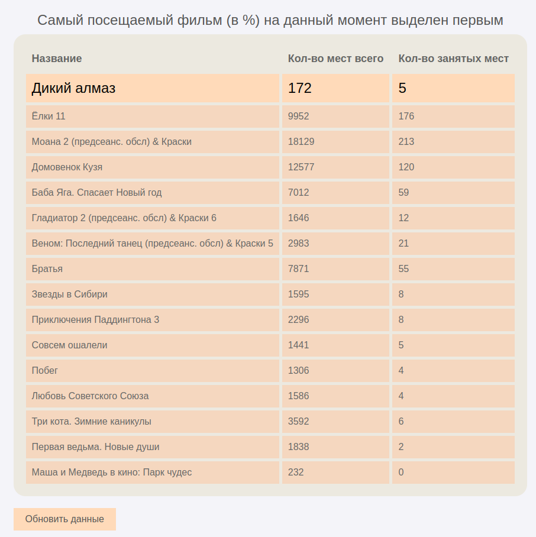

**Самый посещаемый фильм в кинотеатрах Киномакса**
---
Запуск
---
для запуска необходимо запустить файл `./build.sh`, подождать и перейти по адресу, который появится в консоли

Работа сервиса
---

Сервис предоставляет данные о популярности фильмов на основе проданных билетов:

парсятся данные по кнопке Обновить данные. Процесс парсинга занимает длительное время (примерно 8 минут).

К сожалению, я не смог оптимизировать данный процесс и приходится ждать.

Таблица фильмов формируется из БД.

Парсинг
---

Парсинг происходит с помощью библиотеки bs4 и requests. Я получаю html код со страницы <https://kinomax.ru/>, 
полсле чего я ищу все постеры к фильмам, перехожу по вшитым в них href'ам, забираю название и обрабатываю все 
сеансы на страницы с расписанием, то есть считаю колиство всех мест и количество занятых мест. 
Процесс подсчета мест по фильмам можно посотреть в консоли. (на сайте я не смог сдеать :( )

База данных
---

Я использую sqlite3.

Как только парсинг подошел к концу, я записываю полученные данные в БД.